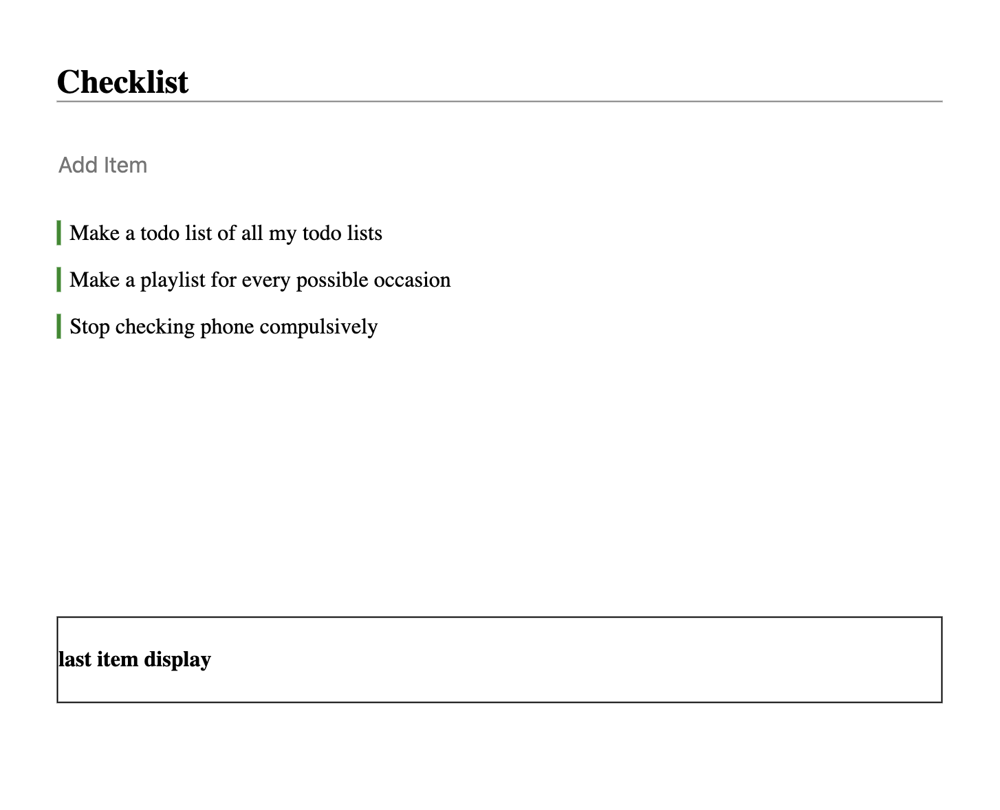

## Todo React-Redux Web App

### Overview

For this lab, we will work ontop of our <b>Todo</b> web application starter code. I encourage you to take a few minutes to browse through the files first- you'll find pseudocode throughout them as well. Our current application has one <i>stateful component</i> which is our `TodoList.js`. At this stage, we are only able to <b> create </b> a new todo item. What we would like to do next is be able to <i> display our last item inside of the todo list </i>. `LastItemDisplay.js` currently does not have access to our state default data which is stored in `TodoList.js`. We will use this project as an introduction to <b>Redux</b> and it will serve as a boiler plate for future projects! 

#### Redux 
- Predictable: Redux helps you write applications that behave consistently, run in different environments (client, server, and native), and are easy to test.
- Centralized: Centralizing your application's state and logic enables powerful capabilities like undo/redo, state persistence, and much more.
- Debuggable: The Redux DevTools make it easy to trace when, where, why, and how your application's state changed. Redux's architecture lets you log changes, use "time-travel debugging", and even send complete error reports to a server.
- Flexible: Redux works with any UI layer, and has a large ecosystem of addons to fit your needs.
 

#### What to expect from this lab
- Instructional code along with setting up Redux 
  - Transfer our current state into a Redux store
  - Display last item on our todo list
- Independent work to finish off a CRUD application
  - Update items
  - Delete items

 

#### Getting Started

1. Clone this repository
2. `npm start`
3. `npm i`

<b>~~~~~~ Ready! ~~~~~~~ </b>
</b> 
 

